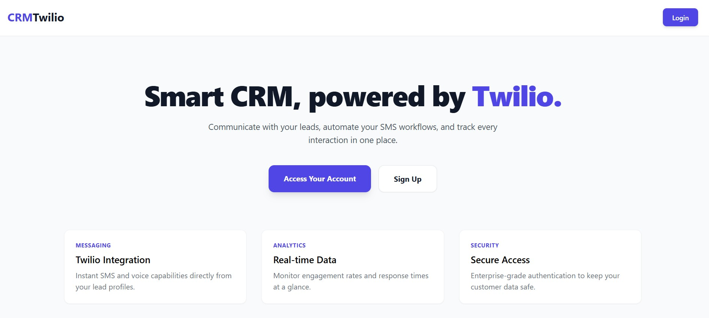
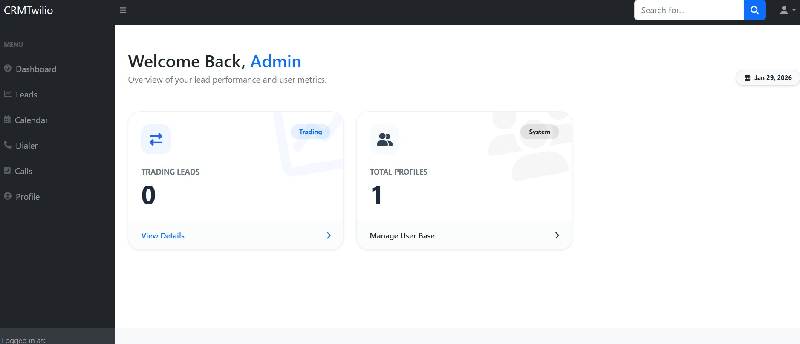
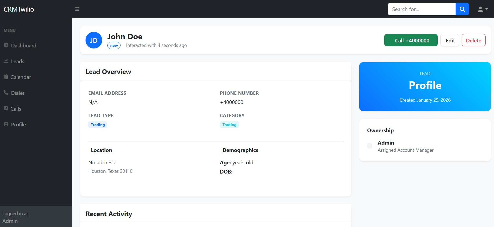

# 📞 Laravel CRM & Twilio Cloud Dialer

A modern, high-performance Lead Management System integrated with Twilio Voice services. This CRM allows teams to import leads, manage outreach, and place calls directly from a "fancy" browser-based dialer.



## ✨ Features

* **Smart Authentication:** Secure login and registration with immediate dashboard redirection.
* **Lead Management:**
    * **Bulk Import:** Upload leads via **Excel (.xlsx, .csv)** or **VCF** files.
    * **Manual Entry:** Quickly add individual leads via a clean UI.
    * **Full CRUD:** View, search, and edit lead information effortlessly.
* **Cloud Dialer:** Integrated Twilio-powered dialer with a premium light-themed interface.
* **Event Calendar:** A dedicated page to schedule follow-ups and track appointments.
* **Future Ready:** The SMS engine is currently open for development—feel free to contribute!

## 📸 Screenshots

| Dashboard Overview | Lead Management | Integrated Dialer | Event Calendar |
| :---: | :---: | :---: | :---: |
|  |  |  |  |

---

## 🚀 Installation & Setup

Follow these steps to get your local environment running.

### 1. Clone & Install
```bash
git clone [https://github.com/johnsoncrystalkalu/CRM-laravel-twilio.git](https://github.com/johnsoncrystalkalu/CRM-laravel-twilio.git)
cd your-repo-name
composer install
npm install && npm run dev